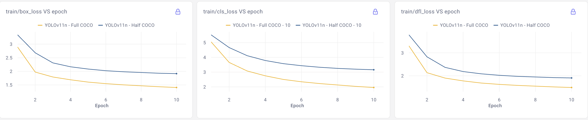
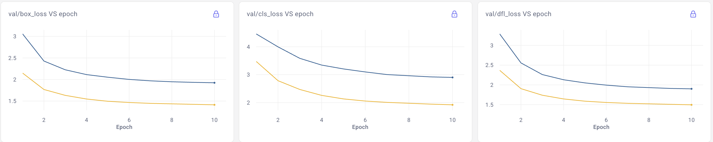

# Negative Flip Analysis: Object Detection Model Comparison

This work introduces a **Negagive Flip Analysis** to quantify performance regression between object detection models beyond standard metrics such as mAP. 
All experiments are conducted on the COCO validation dataset using YOL-based detector.

## 🎯 What is Negative Flip?
A **Negative Flip** occurs when an object is correctly detected by a baseline model (Model A) but missed by the new model (Model B).

I defined three types: 
- **Location Negative Flip (LNF)**: Objects correctly detected by Model A but missed by Model B
- **Classification Negative Flip (CNF)**: Objects detected by both models, but misclassified by Model B
- **Total Negative Flip (TNF)**: Combined failures across both categories

## 📐 Negative flip Rates
``` 
LNF_rate = LNF_total / N_total
CNF_rate = CNF_total / N_loc  
Flip_difference = CNF_rate - LNF_rate
``` 
Where:

- *N_total*: Total ground truth objects
- *N_loc*: Objects localized by both models
- *Flip Difference*: Indicates whether problems are primarily localization (< 0) or classification (> 0) related

## 📦 Dataset Setup

You can download COCO by running: 
``` 
python src/training-yolo/dowload_coco.py
``` 
All experiments use: 
- COCO validation set
- IoU threshold = 0.5 
- 36,335 ground-truth objects


## 📊 Experiment 1: Architectural Evolution (YOLOv8n vs YOLOv11n)
**Research Question:** How do architectural improvements affect detection performance and negative flips?

### Standard metrics
| Model     | mAp   | mAp50 | mAp75 | Precision  | Recall | 
|-----------|-------|-------|-------|------------|--------|
| YOLOv8n  - Pre trained | 37.14% | 52.11% | 40.39% | 63.41%      | 47.43%
| YOLOv11n - Pre trained | **39.25%** | **54.86%** | **42.73%** | **65.29%** | **50.43%**

### Negative Flip Results 

| Metric | Value | Interpretation |
|------|-------|-------------|
| LNF Rate | 5.10% | YOLOv11n misses 5.1% of objects that YOLOv8n detects |
| CNF Rate  | 0.53% | Very few misclassifications among shared detections|
| TNF Rate | 5.35% | Overall negative flip rate |
| Flip Difference | **-4.85%** | Localization dominates |

#### Key Statistics

- Total Objects: **36,335**
- Both Models Detected objects: **17,474 (48.1%)**
- Location Negative Flips: **1,853**
- Classification Negative Flips: **92**


## 📊 Experiment 2: Training Data Scale Impact (Half COCO vs Full COCO)
**Research Question:** How does training data size affect detection capabilities?

Both models are trained from scratch using the same **YOLOv11n** architecture.

### Training Curves 


### Validation Curves



### Standard metrics
| Model     | mAp   | mAp50 | mAp75 | Precision  | Recall | 
|-----------|-------|-------|-------|------------|--------|
| YOLOv11n - Pre trained | 39.25% | 54.86% | 42.73% | 65.29%      | 50.43 
| YOLOv11n - Half COCO | 31.20% | 44.71% | 33.80% | 56.66%      | 41.60%  
| YOLOv11n - Full COCO | **34.99%** | **49.41%** |  **38.09%** | **60.35%**     | **45.88%**

### Results Summary

| Metric | Value | Interpretation |
|------|-------|-------------|
| LNF Rate | 2.30% | Half-COCO model finds 836 objects Full-COCO model misses |
| CNF Rate  | 0.40% | Classification remains stable |
| TNF Rate | 2.46% | Overall negative flip rate  |
| Flip Difference | -2.14% | Localization dominates |

### Key Statistics

- Total Objects: **36,335**
- Both Models Detect: **14840  (40.84%)**
- Location Negative Flips (LNF): **836**
- Classification Negative Flips (CNF): **60**

# 📊 Experiment 3: Knowledge Distillation 
**Research Question**: Can knowledge distillation reduce negative flips when transferring from an older architecture?

## Methology
### KD Setup:
- **Teacher**: YOLOv8n (pre-trained)
- **Student**: YOLOv11n (trained from scratch)
- **Training**: 30 epochs on full COCO dataset
- **Image size**: 640×640
- **Optimizer**: SGD with standard YOLO settings

#### Feature-based KD ####

Encourages intermediate representation similarity: 

$$L_{{KD}}^{{feat}} = \frac{1}{K} \sum_{k=1}^{K} \| F_s^{k} - F_t^{k} \|_2^2$$
- $$F_s^{k} - F_{t}^{k}$$: student and teacher feature maps 
- $$K$$: P3,P4,P3 feature levels 


#### Response-based KD ####

Aligns detection head class probabilities:

$$
L_{KD}^{resp} = \frac{1}{L} \sum_{l=1}^{L} w_{focal}^l \cdot 
KL\Big(\text{softmax}(\frac{z_s^l}{T}), \text{softmax}(\frac{z_t^l}{T})\Big)
$$


- $$z_s, z_t$$, students and teacher classification logits 
- T: temperature scaling 
- L: detection head layers

Confidence Thresholding: Distillation is applied when the teacher is confident: 

- $$p_t=\max (softmax(z_t)) > threshHold$$ 

Focal Weighting
Each location is reweighted to emphasize hard examples:

- $${w}_{focal}: (1-p_t)^{\gamma}$$


**Total Training Loss**

$$L_{YOLO} = L_{box} + L_{cls} + L_{dfl}$$

$$L_{Total} = L_{YOLO} + \alpha \times L_{KD}$$


### Standard metrics
| Model     | mAp   | mAp50 | mAp75 | Precision  | Recall | 
|-----------|-------|-------|-------|------------|--------|
| YOLOv8n  - Pre trained (Teacher) | 37.14% | 52.11% | 40.39% | 63.41%      | 47.43%
| YOLOv11n - Feature KD from YOLOv8n | 36.53%| 51.36% | 39.37%| 63.17%     | 47.01%
| YOLOv11n - Response KD from YOLOv8n | 36.64% | 51.53% | 39.69% | 63.63%      | 47.17%
| YOLOv11n - Pre trained | **39.25%** | **54.86%** | **42.73%** | **65.29%**      | **50.43%**

### Negative Flip Results (KS vs NO-KD)
Comparison: YOLOv8n (Teacher/Baseline) vs YOLOv11n with Knowledge Distillation (Student)

| Metric | Experiment 1 | Response KD | Feature KD |
|------|------------------|------------------|------------------|
| **LNF Rate** | 2.30%| 8.06% | 7.88% |
| **CNF Rate** |0.40%  | 0.49% | 0.54% |
| **TNF Rate** | 2.46% | 8.29% | 8.12% |
| **Flip Difference** | -2.14% | -7.84% | -7.63% |
| **Dominant Error Type** | Localization | Localization | Localization |


| KD increases localization negative flips by ~55% compared to the non-KD baseline, while classification consistency remains largely unchanged.

### Key Statistics Comparison

| Statistic | Experiment 1|  Response KD | Feature KD |
|---------|------------------|------------------|------------------|
| **Total Objects** | 36,335  | 36,335 | 36,335 |
| **Objects Detected by Both Models** |17,474 (48.1%) | 16,399 (45.12%) | 16,464 (45.2%) |
| **Location Negative Flips** |1,853 | **2,928** | **2,863** |
| **Classification Negative Flips**| 92 | 81 | 89 |

| KD reduces overlap between teacher and student detections, indicating degraded spatial generalization rather than semantic confusion.


# 📍  Conlusion 
## 1.Training Data Impact vs Universal Performance
- Increasing training data improves standard metrics, but the model may fail to detect certain objects previously detected with less data (e.g., 2.3% LNF).
- Models trained on different data volumes specialize differently in detection, rather than achieving universally superior performance.


## 2.Localization vs Classification Challenges
- Negative flips are concentrated on localization.
- Classification performance remains consistent once objects are detected.
- Model evolution efforts should focus on maintaining detection coverage, not classification improvement.

## 3.Knowledge Distillation & Negative Flip Analysis
- KD from an older teacher (YOLOv8n → YOLOv11n) does not reduce negative flips.
- KD may increase localization errors despite maintaining competitive standard metrics.
